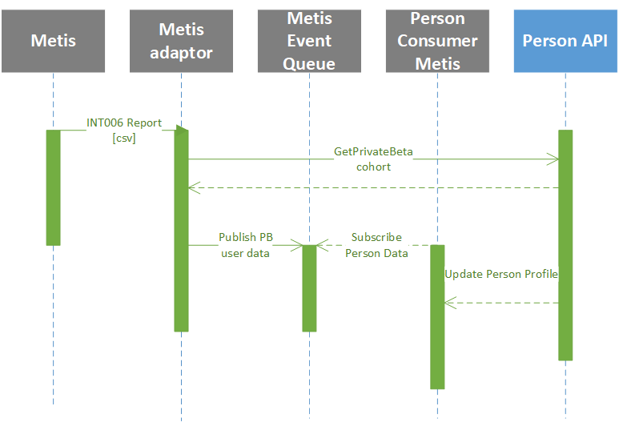

# Onboarding a user

## Overview

HO Border force uses “Time and Attendance Management System (TAMS)” for capturing time & attendance information from the operational areas and for validating that the correct Annualised Hours Working (AHW) payments are made to staff. TAMS does not satisfy all of Border Forces operational needs leading to 'off system' workarounds including spreadsheets being built to plug the gaps and so a brand-new system, Callisto is being developed by DDaT to replace TAMS.

The Private beta phase involves inviting a limited number of people to use the service so that we can get feedback and improve it. Once you’ve improved the service and are confident you can run it at scale, you take an assessment to move into public beta. This approach allows the system to be improved and enhanced using the lessons learnt during Private Beta mitigating the risk of a wider rollout failing.

Once the pre-beta test period has ended and the service has successfully met the acceptance criteria for transition into the private beta phase, one of representative ports (such as Liverpool) will migrate to Callisto for the purposes of time recording, rostering and scheduling. Thereafter at intervals the private beta service will be released to other ports as part of a phased roll out of the private beta service. 

To function Callisto requires similar data feeds to TAMS so that it knows about the attributes of a Person, their contract and, if applicable their Annualised Working Hour (AHW) agreement such that Callisto can collect the relevant data and perform the necessary calculations. For the purposes of onboarding there are two systems which are the master for much of the data required.

These systems are:

1. METIS – Home Office HR system responsible for and master of Person data including contractual agreement, AHW agreement, absences, and salary.
2. TAMS – TAMS will maintain and hold an individuals Agreement information, namely their accrual targets and their to-date balances against those agreements. 

This section of the High Level design is intended to detail how the relevant information will be obtained from these external systems and stored in Callisti. Whilst the process described is principally for onboarding a user from TAMS to Callisto for the start of Private Beta, once running there are multiple "business as usual" user journeys which must be considered which are detailed here [TODO]

## Private Beta Migration Approach

The process of taking an empty Callisto database and making it live is a significant process and can be divided into several phases with much of it performed well before go-live.

1.	Pre-requisites – Loading the organisation hierarchy, configuring user access roles and reference data such as populating drop downs.
2.	Onboarding – Migrating a pre-determined set of users identified as the Private Beta cohort onto the system. 

### Ports

During Private Beta it is important that all users in a given location, for example, a port are being scheduled and recording their time using the same system. This approach means that coverage of activities across a location can be seen on one system and that user and managers are using the same system simplifying approvals and other processes.

The process of onboarding a cohort of users at a single location requires a significant amount of effort as components of Callisto require data modelling the ports operational organisation structure and working patterns before a user can be scheduled.

Although subject to change the process is expected to follow the steps below

1.	Once a port is selected for migration, employees working at that port will be given notice about the move into Callisto.
2.	The ports operational hierarchy will be built in Callisto for the selected port. 
3.	Planners will have early access to Callisto to build shift patterns and shifts manually
4.	New shift templates in Callisto will be created manually.
5.	Once port staff have been onboarded the previous roster TAMS will be manually retrieved and it will be entered as shift-constraints into Callisto    
7.	Once all shift-constraints are generated, new rosters will be generated.

Further elaboration on the Scheduling data required  will be found in the [Scheduler container definition](../containers.md#scheduler).  

### Onboarding process

1. Once staff to be onboarded to Callisto are identified the process is initiated by creating their skeleton Personal Profile in Callisto with the important information being their METIS staff number. To make this easier it is expected that Callisto will import a CSV file to indicate that are 'Onboarding'.
2. Callisto will populate the required elements of their Personal Profile by processing information produced by the master for such data, METIS. 
3. For AHW workers their accrual targets and accrual balances will be imported.
4. An admin or manager adds the user to the organisational hierarchy, configures skills and enters any missing information not supported by the integration.
5. User can login and configure their personal preferences.

#### Person

The onboarding process will be initiated by identifying the Private Beta cohort of users and building a list within Callisto consisting of their Metis Staff Number. Ideally this will be an import of a csv file supplied by the port being onboarded.

We do need to source information to populate Callisto for all we need in Private Beta. A definition of the data required [TODO]

##### Person Profile

Callisto requires information about a Person in order to understand their contractual obligations such as hours worked, full time or part-time, modernised or pre-modernised contracts in order to schedule them and also to correctly calculate important aspects such as their accruals and meal breaks. 

METIS is the master for this information but the nature of this interface is not yet defined but may either be by ingesting same file that TAMS currently ingests to achieve the same purpose (an interface known as INT006) or by using the new enhanced Integration Mechanism (191/192).

The person profile will reside on the [Person Container](../containers.md#person) described here 

##### Agreement Targets

An agreement is the contract between the HO and the employee to work on a non standard working pattern for a years period. the elements that constitute the agreement give the employee a % uplift in their basic salary, these elements covers the 9 building blocks: 

To track accrual balances for an individual against their agreement this information must be imported (or entered) into Callisto.
It is proposed that the TAMS MI Interface be consumed by Callisto to populate this information.

The preliminary design for ingesting the agreement is detailed in the [TAMS Agreement Adaptor](../containers.md#tams-agreement-adapter)

##### Accrual Balances

Staff when migrated to Callisto will already have accrued balances against their accrual buckets and this data must be migrated into Callisto This data is expected to be generated from TAMS as TAMS/Kronos already provides a report containing the Percentage AHW balance completed (pensionable / non- pensionable) to SSCL.

It should be ensured that while accruals export and load process start, time-entry feature in as-is TAMS should be disabled for the employees of the selected port. 

The preliminary design for ingesting the accrual balances is detailed in the [TAMS Agreement Adaptor](../containers.md#tams-agreement-adapter)
 
#### Data maintained within Callisto
There is certain data pertinent to a user that needs to be configured within Callisto, for example:
1.	User preferences how do they want to receive notifications
2.	Home page content
3.	Shift preferences (unless imported from TAMS?)

# Integration Patterns

Our preferred integration pattern for external systems passing data to Callisto is the publish & subscribe design pattern using a messaging bus, such as Kafka to which the external system can publish events. 

In the case of acquiring Person Profile information from METIS whilst this cannot be achieved witihin the scope of Private Beta the introduction of a METIS Adaptor allows us to simply replace the adaptor once full asynchronous METIS interfaces can be built.

This is more efficient than Callisto polling Metis looking for changes that have occurred as well as guaranteeing the integrity of the message passing mechanism. In addition, this approach eliminates tight coupling of Metis & Callisto allowing either system to operate without the other.

The following diagram details the approach but other integrations will be similar in nature and philosophy.

	
# To Do

1. Define how operational hierarchy vs organizational hierarchy are different - terminology
2. Notion of pre-requisites is very worthwhile calling out eg org hierarchy needs to be there before we import a person. I'd be inclined to make that point quite strongly - with headers perhaps
3. Also have a summary of what is needed from a person perspective before that person can enter time or be rostered etc. Saves people having to dive straight into the detail that's been added around Accruals etc
