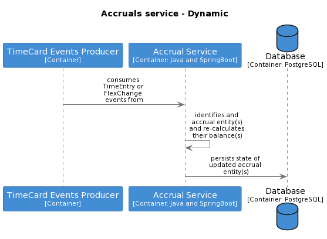

# Record time
Jira ref - [EAHW-925](https://collaboration.homeoffice.gov.uk/jira/browse/EAHW-925)

The recording of time involves the creation and/or modification of [`TimeEntry`](./../containers.md#timecard-resources-public)  resources.

## Inputs
Record time is initiated in one of three ways which are differentiated by which kind of user that triggers the recording of time.

### Scheduler initiated 
A Scheduler interacts with the TimeCard container in an indirect way. Their main goal is to schedule people but in doing so they trigger the creation of [`TimeEntry`](./../containers.md#timecard-resources-public)instances in the TimeCard container.

 1. A Scheduler rosters a [`Person`](./../containers.md#timecard-resources-public) known to TimeCard  onto a shift
 2. The Scheduled Events Producer publishes a [`ScheduledEntry`](./../containers.md#timecard-events-consumed)  event to it's topic 
 3. The TimeCard container receives the [`ScheduledEntry`](./../containers.md#timecard-events-consumed) event via it's topic subscription 
 4. The TimeCard container uses the data in the [`ScheduledEntry`](./../containers.md#timecard-events-consumed) event to create a [`TimeEntry`](./../containers.md#timecard-resources-public) entity in it's internal Database

### User initiated 
A user wants to record or amend a [`TimeEntry`](./../containers.md#timecard-resources-public) that they own. 

They interact with the TimeCard container directly through it's user interface. More detail can be found in the [detailed design for record-time](https://github.com/UKHomeOffice/callisto-timecard-restapi/tree/main/docs/features/record-time.md).

**TODO - person identity resolution & permissions**

### Manager initiated 
A manager of a given owner wants to record or amend a [`TimeEntry`](./../containers.md#timecard-resources-public) belonging to that owner.

They interact with the TimeCard container directly through it's user interface. More detail can be found in the [detailed design for record-time](https://github.com/UKHomeOffice/callisto-timecard-restapi/tree/main/docs/features/record-time.md).

## Outputs

### Internal changes
Record time results in the  creation or modification of  a [`TimeEntry`](./../containers.md#timecard-resources-public) instance in the TimeCard container's internal database.

### External changes
When a `TimeEntry` is successfully recorded by the TimeCard container it triggers the publication of an event that encapsulates that `TimeEntry` resource along with the type of action that was performed on the resource. As an event producer the TimeCard container should follow the blueprints below - 

- [topic creation](../blueprints/topic-creation.md)
- [event publication (schema & trigger points)](../blueprints/event-publication.md)

#### Event consumers
There are a number of Callisto containers that consume record time events that are produced by the TimeCard container. The sections below list the containers that are consuming those  events and describe what action is taken by the consuming container when the event is received. 

##### Accruals

The Accruals container consumes all `TimeEntry` events and uses them to keep Accrual balances up to date. Data in the `TimeEntry` event is used to determine which Accrual modules are effected by the recorded time. From there Accruals uses the time that has been recorded to update the balance on the identified Accrual modules.

**More detail** 

- [Accruals TimeEntry consumer design](https://github.com/UKHomeOffice/callisto-accruals-restapi/blob/eahw-1249/annual-target-hours/docs/features/annual-target-hours/timecard-timeentry.md)
- [Accruals Annual Target Hours feature](https://collaboration.homeoffice.gov.uk/jira/browse/EAHW-1249)

 
