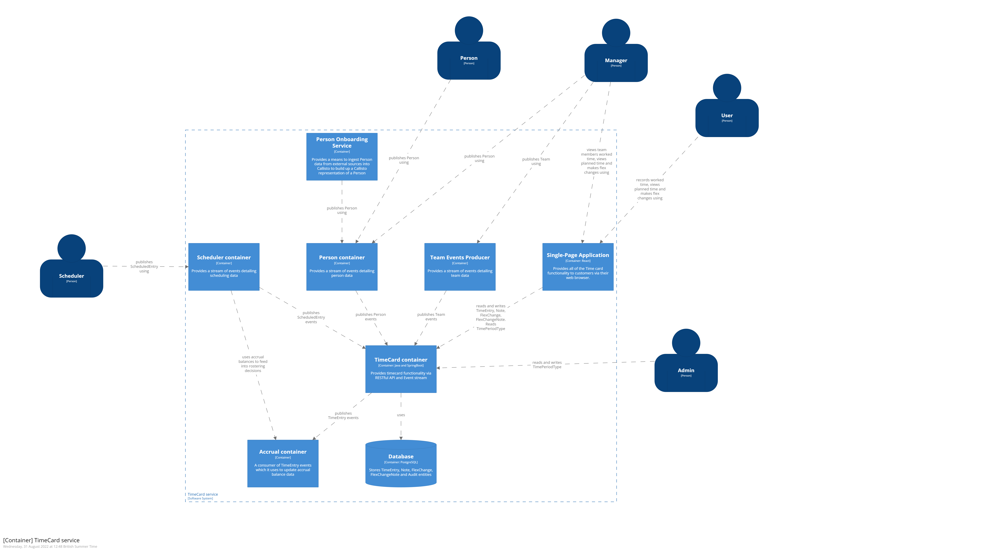

# Record time
Jira ref - 

The recording of time involves the creation and/or modification of [`TimeEntry`](./../containers.md#timecard-resources-public)  resources.

## Inputs
Record time is initiated in one of three ways which are differentiated by which kind of user that triggers the recording of time.

### Scheduler initiated 
A Scheduler interacts with the TimeCard container in an indirect way. Their main goal is to schedule people but in doing so they trigger the creation of [`TimeEntry`](./../containers.md#timecard-resources-public)instances in the TimeCard container.

 1. A Scheduler rosters a [`Person`](./../containers.md#timecard-resources-public) known to TimeCard  onto a shift
 2. The Scheduled Events Producer publishes a [`ScheduledEntry`](./../containers.md#timecard-events-consumed)  event to it's topic 
 3. The TimeCard container receives the [`ScheduledEntry`](./../containers.md#timecard-events-consumed) event via it's topic subscription 
 4. The TimeCard container uses the data in the [`ScheduledEntry`](./../containers.md#timecard-events-consumed) event to create a [`TimeEntry`](./../containers.md#timecard-resources-public) entity in it's internal Database

### User initiated 
A user wants to record or amend a [`TimeEntry`](./../containers.md#timecard-resources-public) that they own. 

They interact with the TimeCard container directly through it's user interface. More detail can be found in the [detailed design for record-time](https://github.com/UKHomeOffice/callisto-timecard-restapi/tree/main/docs/features/record-time.md).

**TODO - person identity resolution & permissions**

### Manager initiated 
A manager of a given owner wants to record or amend a [`TimeEntry`](./../containers.md#timecard-resources-public) belonging to that owner.

They interact with the TimeCard container directly through it's user interface. More detail can be found in the [detailed design for record-time](https://github.com/UKHomeOffice/callisto-timecard-restapi/tree/main/docs/features/record-time.md).

### Outputs

#### Internal changes
Record time results in the  creation or modification of  a [`TimeEntry`](./../containers.md#timecard-resources-public) instance in the TimeCard container's internal database.

#### External changes
Once the Internal changes have been made successfully and the TimeCard container's data is in a consistent state it then publishes the new or modified [`TimeEntry` as an event via it's topic](./../containers.md#timecard-events-produced).

One of the consumers of this topic is the [`Accruals container`](./../containers.md#accruals). It takes the [`TimeEntry`](./../containers.md#timecard-events-produced) event and uses it's content to update zero or more target balances to ensure that the [`TimeEntry`](./../containers.md#timecard-resources-public) owner's Accrual balances reflect the time that they have worked or have been scheduled to work.

 