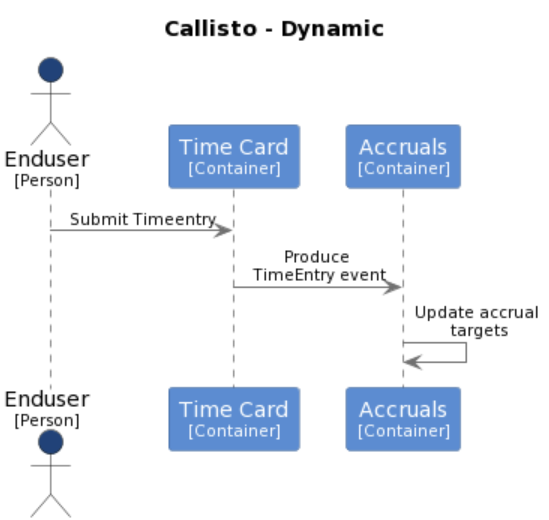

# Submit Time Entry

The TimeEntry can be stored independently of Accruals being calculated. This decoupling permits Callisto to service the priority business need even if Accruals was unavailable.

Decoupling is achieved by using Kafka queues to perform asynchronous communications. Also of note is that the Accruals API is the end point responsible for both the business logic and for persistently storing data to the database.

Monitoring of  the Timecard event queue will permit Accruals to scale up or down as required to match the load.

