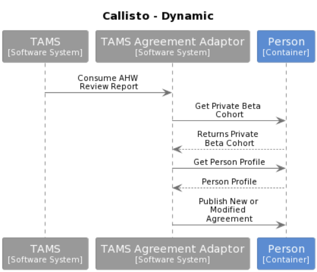

# Collaborations

In a loosely coupled system it is common and likely that individual containers will need to work together to achieved a system activity or service an end user request.

A number of the key routes through the system have been illustrated in the following diagrams to how the various services are choreographed to perform some  of the activities required. 

These use cases focus on:

- The triggering event from the user or a system event.
- The communication of data to subsidiary services required to complete the activity.
- The propagation of event information to other parts of the system. 

The use cases detailed subject to elaboration with Business Analysts are:

- Submit Time Entry
- Communicate Schedule
- Onboarding
- Ingest Agreement (from TAMS)
- Consume Agreement
- Onboarding a user
	- METIS data
	- TAMS data
	- Manager configuration
- Absences
	- Callisto flow
	- METIS communication (to & from)

## Submit Time Entry

## Communicate Schedule

##Ingest Agreement (from TAMS)

## Consume Agreement

## Onboarding a user

## METIS data

## TAMS data

## Manager configuration

## Absences

## Callisto flow

## METIS communication (to & from)
