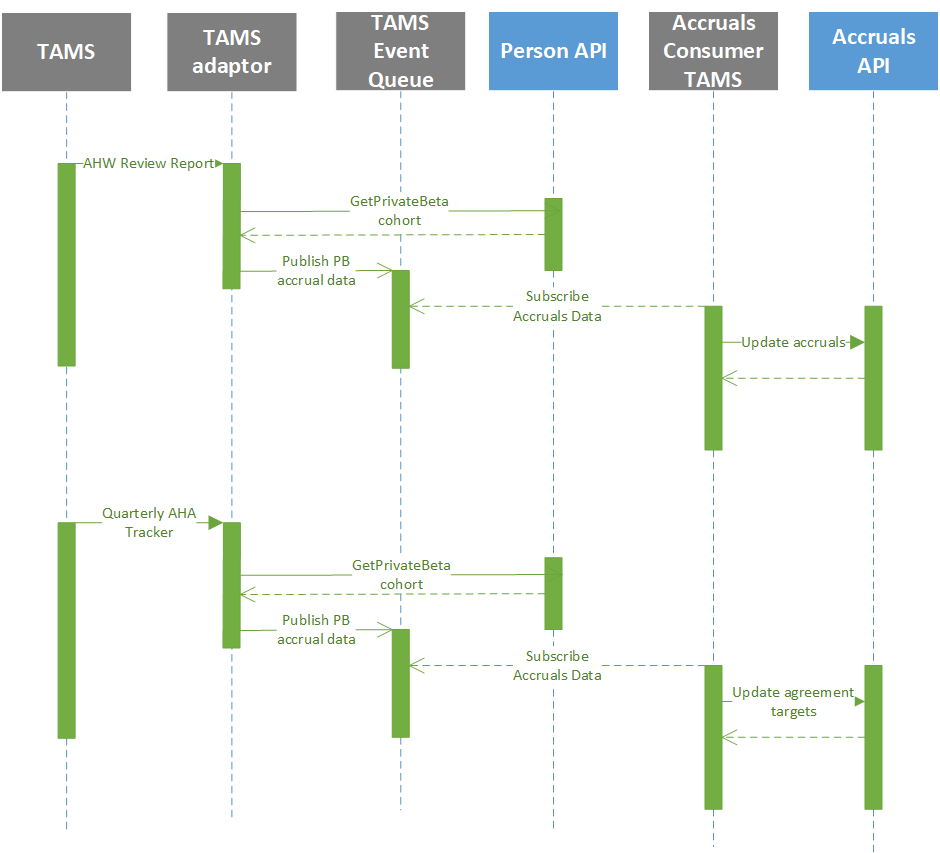
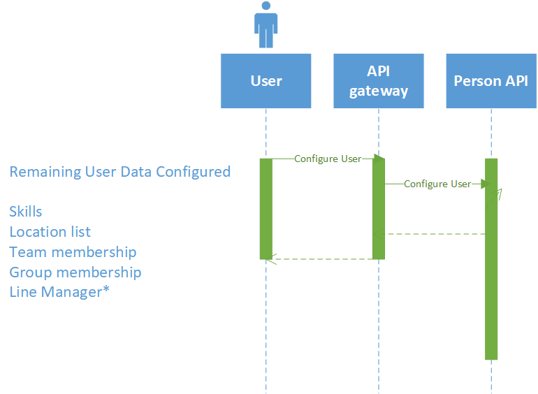

# Onboarding a user

## Overview

HO Border force uses “Time and Attendance Management System (TAMS)” for capturing time & attendance information from the operational areas and for validating that the correct Annualised Hours Working (AHW) payments are made to staff.

Private beta of Callisto, the proposed TAMS replacement requires migration of users and associated information into Callisto from various systems and interfaces to the consumers of Callisto data. 

Across Border Force only a small percentage of users will be in Callisto and so Metis Integration must be able to cope with data from either TAMS or Callisto.

Whilst the process described here is principally for onboarding a user from TAMS to Callisto for the start of Private Beta once running there are multiple business as usual user journeys which must be considered. The majority of these fall into the category of a change in a users contracts with some examples being:

- User leaves Private Beta Cohort to join a Location not yet in Callisto
- User in Private Beta leaves AHA to move to Flexi working
- User in Private Beta leaves HO

## Private Beta Migration Approach

The process of taking an empty Callisto database and making it live is a significant process and can be divided into several phases with much of it performed well before go-live.

1.	Pre-requisites – Loading the organisation hierarchy, configuring user access roles and reference data such as populating drop downs.
2.	Onboarding – Migrating a pre-determined set of users identified as the Private Beta cohort onto the system. 

### Ports

1.	Once a port is selected for migration, employees working at that port will be given notice about the move into Callisto.
2.	Using a combination of manual effort and import of existing files, team profile and operational hierarchy will be built in Callisto for the selected port(s).  
3.	It is intended that planners have access to the system to build shift patterns and shifts.
4.	New shift template in to-be systems should be created manually.
5.	The previous roster detail for each employee for the selected port from as-is TAMS will be manually retrieved and it will be entered as shift-constraint into Callisto    
6.	Once all shift-constraints are generated, new rosters will be generated in to-be system.  

### Person

The onboarding process will be initiated by identifying the Private Beta cohort of users and building a list within Callisto consisting of their Metis Staff Number. Ideally this will be an import of a csv file.

We do need to source information to populate Callisto for all we need in Private Beta. A definition of the data required [TODO]

Our preference for the source of this information is:
1.	METIS using the current INT006 flat file unless METIS can supply a revised/enhanced version for Private Beta
2.	TAMS AHW Reports extracted in an electronic format (csv)
3.	Entered manually in Callisto, essentially anything we are unable to source from above.

#### Data maintained within Callisto
There is certain data pertinent to a user that needs to be configured within Callisto, for example:
1.	User preferences how do they want to receive notifications
2.	Home page content
3.	Shift preferences (unless imported from TAMS?)

Covering this in more detail:

### Accruals  

Staff when migrated to Callisto will already have accrued balances against their accrual buckets and this data must be migrated into Callisto This data is expected to be generated from TAMS as TAMS/Kronos already provides a report containing the Percentage AHW balance completed (pensionable / non- pensionable) to SSCL.

It should be ensured that while accruals export and load process start, time-entry feature in as-is TAMS should be disabled for the employees of the selected port. 
 
### Agreement 
An agreement is the contract between the HO and the employee to work on a non standard working pattern for a years period. the elements that constitute the agreement give the employee a % uplift in their basic salary, these elements covers the 9 building blocks: 

To track accrual balances for an individual against their agreement this information must be imported (or entered) into Callisto.
It is proposed that the TAMS MI Interface be consumed by Callisto to populate this information.

## Onboarding process

It is planned that staff will be migrated to Callisto during Private Beta and beyond. The process for new staff migrating after initial load is like onboarding and is, as follows:

1.	Staff to be migrated are added to the Callisto via the import of a CSV file which will update their PersonProfile to indicate that are 'Onboarding'.
2.	Callisto will process the INT006 and find the new staff in this file and create a User Profile for them. Users in this status cannot enter time until the onboarding process is completed.
3. For AHW workers their accrual targets and accrual balances will be imported from pre-existing TAMS reports.
4.	An admin or manager adds the user to the organisational hierarchy, configures skills and enters a Line Manager (if not imported from TAMS).
5.	User can login and configure their personal preferences.

##METIS data

	
##TAMS data

	
##Manager configuration

