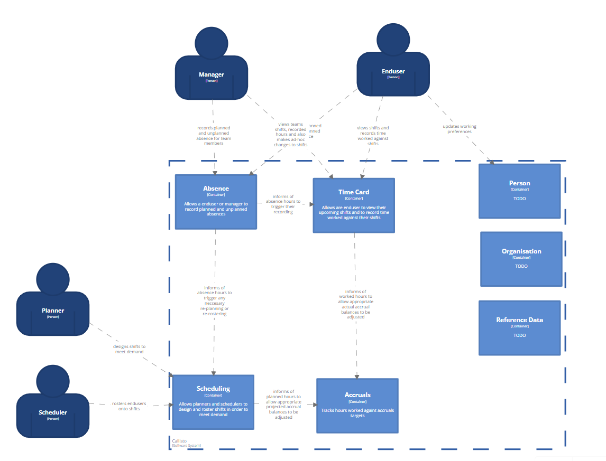

# Callisto's Containers

Callisto as a system is made up of a number of loosely coupled containers that combine to deliver the various workflows that Callisto supports.

## TimeCard
At it's core the TimeCard container allows people to view time that they're been planned to work and to enter time that they've worked. 

- **users** - manager and worker
- **collaborations** - absence (consumes) and accruals (produces)

[TimeCard container definition](https://github.com/UKHomeOffice/callisto-timecard-restapi/blob/main/docs/container-definition.md)

## Scheduler
The Scheduler container is used by planners to design and staff (roster) shifts.

- **users** - planner and scheduler
- **collaborations** - absence (consumes)

[Scheduler container definition](https://github.com/)

## Accruals
In Border Force many people are on what is known as an Annualised Hours Agreement (AHA). In short each person will have a set of target hours that they need to work in order to gain an uplift in their basic pay. The Accruals container tracks how people are performing against those targets.

### Resources
- No resources are exposed

### Events produced
- `AHABucketBalance` - an event that holds the balance of a person's AHA Bucket at a given point in time

### Events consumed
- `AHABucketTarget` - used to set up an initial balance for the given AHA Bucket
- `TimeEntry` - feeds into the calculation of zero or more AHA Bucket balances
- an event that holds data about a period of time worked by a given person. It includes the type of activity that was worked in the time
- `AHABucketBalance` - Capture's a persons AHA Bucket balance. If a person is to be onboarded onto Callisto in the middle of their agreement period then their balances at the time of the onboarding need to be known so that Accruals can set a balance baseline

### Clients
#### Users
- No end users. The Accruals container can be thought of as a background (or daemon) process

#### Containers
- Scheduler - consumes the `AHABucketBalance` event stream

[Accruals container definition](https://github.com/)

## Person 
Holds data about a person that other containers in Callisto need such as what skills a person has and what their preferred hours of working are. Rather than duplicating this data the Person container is the single source of truth.

[Person container definition] - To be created

## Organisation

- **users** - TBC
- **collaborations** - TBC

[Organisation container definition](https://github.com/)

## Reference data
Holds slow changing data that is used across multiple containers. Rather than duplicating this data the Reference data container is the single source of truth.

- **users** - TBC
- **collaborations** - TBC

[Reference data container definition](https://github.com/)

## Absence

- **users** - worker and manager
- **collaborations** - timecard (producer) and scheduling (producer)

[Absence container definition](https://github.com/)

## TAMS Agreement Adapter
At the time of writing (11 Aug 2022) TAMS is the master of AHA Agreement data. The format of that data 

In Border Force many people are on what is known as an Annualised Hours Agreement (AHA). In short each person will have a set of target hours that they need to work in order to gain an uplift in their basic pay. The Accruals container tracks how people are performing against those targets.

### Resources
- No resources are exposed

### Events produced
- `AHABucketTarget` - an event that holds the target associated with a person's AHA Bucket. A target has a time period in which it is effective

### Events consumed
- No events are consumed

### Files consumed
- TAMS Agreement - holds a set of AHA Bucket Targets for a given person
- TAMS Person - **TBC** as to whether or not this extract is needed
- TAMS AHA Balances - holds a set of AHA Bucket Balances for a given person

### Clients
#### Users
- No end users. The TAMS Agreement Adapter container can be thought of as a background (or daemon) process

#### Containers
- Accruals- consumes the `AHABucketTarget` and `AHABucketBalance` event streams

[TAMS Agreement Adapter container definition] **TODO**
