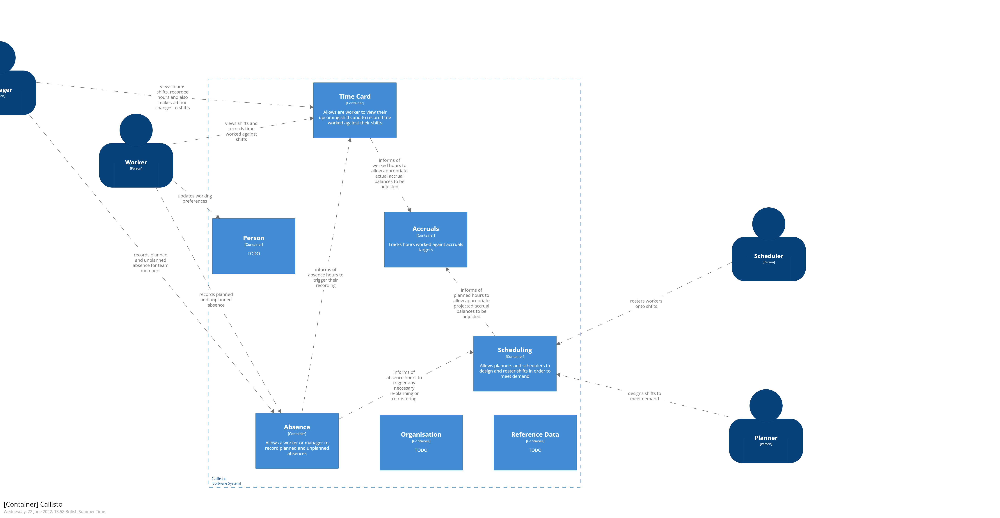

# Callisto's Containers

Callisto as a system is made up of a number of loosely coupled containers that combine to deliver the various workflows that Callisto supports.

## TimeCard
At it's core the TimeCard container allows people to view time that they're been planned to work and to enter time that they've worked. 
users - manager and worker
collaberations - absence (consumes), accruals (produces)

[TimeCard container definition](https://github.com/)

## Scheduler
The Scheduler container is used by planners to design and staff (roster) shifts.
users - planner and scheduler
collaberations - absence (consumes)

[Scheduler container definition](https://github.com/)

## Accruals
In Border Force many people are on what is known as an Annualised Hours Agreement (AHA). In short each person will have a set of target hours that they need to work in order to gain an uplift in their basic pay. The Accruals container tracks how people are performing against those targets.
users - none directly
collaberations - timecard (consumes), scheduling (consumes)

[Accruals container definition](https://github.com/)

## Person 
Holds data about a person that other containers in Callisto need such as what skills a person has and what their preferred hours of working are. Rather than duplicating this data the Person container is the single source of truth.

users - worker
collaberations - TBC

[Person container definition](https://github.com/)

## Organisation

users - TBC
collaberations - TBC

[Organisation container definition](https://github.com/)

## Reference data
Holds slow changing data that is used across multiple containers. Rather than duplicating this data the Reference data container is the single source of truth.

users - TBC
collaberations - TBC

[Reference data container definition](https://github.com/)

## Absence

users - worker and manager
collaberations - timecard (producer), scheduling (producer)

[Absence container definition](https://github.com/)