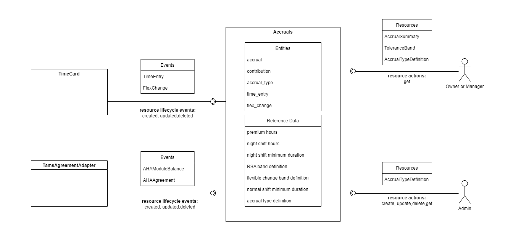

# Callisto's Containers

Callisto as a system is made up of a number of loosely coupled containers that combine to deliver the various workflows that Callisto supports.

## TimeCard
At it's core the TimeCard container allows people to view time that they're been planned to work and to enter time that they've worked. 

### Significant Use cases

 - [record time](/collaberations/record-time.md)
 - ad-hoc changes to shift
 - view upcoming shifts

### Resources
Resources are divided into two categories

 - public - exposed via the TimeCard container's RESTful API
 - private - not visible outside of the boundary of the TimeCard container. Used internally.

#### <a name="timecard-resources-public">Public</a> 
- `TimeEntry` -  the actual recording of hours worked by an employee. In this context the employee is said to be the owner of the `TimeEntry`
- `Note` -  used to carry arbitrary textual information about a date
- `FlexChange` - **TODO**
- `FlexChangeNote` - **TODO**
- `Team` - each team has a manager (a `Person`) and a set of members (`Person` instances). A manager is allowed to view and edit the `TimeEntry` resources for any one of the members of their team. 
- `TeamMember` - collects together a `Person`, their `Team` and the role they have within the team (i.e. `member` or `manager`)

#### Private 
- `Person` - used to hold data relevant when determining what types of time period a given person should be able to enter. Also used in meal-break calculations when recording time 

### Reference data
- `TimePeriodType` - a way to categorise time periods (e.g. a shift, a standard rest day)
- `TeamMemberType` - differentiates different roles that a person may have within a given `Team`

### <a name="timecard-events-produced">Events produced</a>
- `TimeEntry` - an event that holds data about a period of time worked by a given person. It includes the type of activity that was worked in the time
- `FlexChange` - an event that holds data about a change to a planned period of work

### <a name="timecard-events-consumed">Events consumed</a>
- [`ScheduledEntry`] - used to set up an initial default `TimeEntry` so that the rostered person does not have to manually record their time if they work the hours that have been rostered

### Clients
#### Users
- owner - the person who has worked the time that is to be or has been recorded
- manager - looks after a team of `TimeEntry` owners

#### Containers
- [Accruals](#accruals) - consumes the `TimeEntry` event stream

[TimeCard container definition](https://github.com/UKHomeOffice/callisto-timecard-restapi/blob/main/docs/container-definition.md)

## Scheduler
The Scheduler container is used by planners to design and staff (roster) shifts.

- **users** - planner and scheduler
- **collaborations** - absence (consumes)

[Scheduler container definition] - To be created

## Accruals
In Border Force many people are on what is known as an Annualised Hours Agreement (AHA). In short each person will have a set of target hours that they need to work in order to gain an uplift in their basic pay. The Accruals container tracks how people are performing against those targets.

The diagram above shows the Accruals container in the centre with the other Callisto containers that it collaborates with. In addition the diagram shows the different types of end user who will interact with the container through its RESTful API.

Each of these facets of the container are discussed in more detail below.

### Resources
- TODO

### Reference data
- TODO

### Events produced
- `AHAModuleBalance` - an event that holds the balance of a person's AHA Module at a given point in time

### Events consumed
- [`AHAModuleTarget`](#tamsAgreementAdapter_ahaModuleTargetEvent) - used to set up an initial balance for the given AHA Module
- [`TimeEntry`](#timecard-events-produced) - feeds into the calculation of zero or more AHA Module balances it is an event that holds data about a period of time worked by a given person. It includes the type of activity that was worked in the time
- [`FlexChange`](#timecard-events-produced) - feeds into the calculation of zero or more AHA Module balances it is an event that holds data about a change to a planned period of work
- [`AHAModuleBalance`](#tamsAgreementAdapter_ahaModuleBalanceEvent) - Capture's a persons AHA Module balance. If a person is to be onboarded onto Callisto in the middle of their agreement period then their balances at the time of the onboarding need to be known so that Accruals can set a balance baseline

### Clients
#### Users
- owner - the person who has worked the time that is being tracked by Accruals
- manager - looks after a team of  `Accruals` owners
 
#### Containers
- [Scheduler](#scheduler) - consumes the `AHAModuleBalance` event stream

[Accruals container definition](https://github.com/UKHomeOffice/callisto-accruals-restapi/blob/main/docs/index.md)

## Person 
Holds data about a person that other containers in Callisto need such as what skills a person has and what their preferred hours of working are. Rather than duplicating this data the Person container is the single source of truth.

[Person container definition] - To be created

## Organisation

- **users** - TBC
- **collaborations** - TBC

[Organisation container definition](https://github.com/)

## Reference data
Holds slow changing data that is used across multiple containers. Rather than duplicating this data the Reference data container is the single source of truth.

- **users** - TBC
- **collaborations** - TBC

[Reference data container definition] - To be created

## Absence

- **users** - worker and manager
- **collaborations** - timecard (producer) and scheduling (producer)

[Absence container definition] - To be created

## TAMS Agreement Adapter
At the time of writing (11 Aug 2022) TAMS is the master of AHA Agreement data. The format of that data 

In Border Force many people are on what is known as an Annualised Hours Agreement (AHA). In short each person will have a set of target hours that they need to work in order to gain an uplift in their basic pay. The Accruals container tracks how people are performing against those targets.

### Resources
- No resources are exposed

### Reference data
- No Reference Data exposed

### Events produced
- <a name="tamsAgreementAdapter_ahaAgreementEvent">`AHAAgreement`</a> - an event that holds an AHA Agreement resource. An AHA Agreement is linked to a given `Person`. Amongst other things it contains AHA modules purchased by the person and their targets, the effective date of the AHA Agreement and also the person's Flex change and RSA bands
- <a name="tamsAgreementAdapter_ahaModuleBalanceEvent">`AHAModuleBalance`</a> - an event that holds the balance associated with a person's AHA Module. A balance has a date and time at which it was current

### Events consumed
- No events are consumed

### Files consumed
- TAMS Agreement - holds a set of AHA Module targets for a given set of people
- TAMS Holiday Balances - holds a set of holiday balances for a given set of people
- TAMS AHA Balances - holds a set of AHA Module balances for a given set of people

### Clients
#### Users
- No end users. The TAMS Agreement Adapter container can be thought of as a background (or daemon) process

#### Containers
- [Accruals](#accruals)- consumes the `AHAModuleTarget` and `AHAModuleBalance` event streams

[TAMS Agreement Adapter container definition]  - To be created
