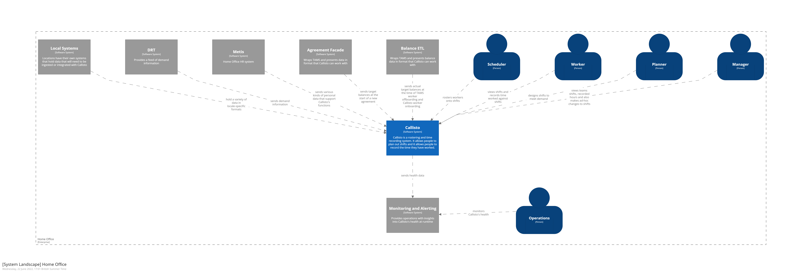

# Callisto's contextual landscape

The Callisto system does not operate in isolation. It interacts with a number of different external systems and it supports a number of different user roles.

## User roles
See index.md

## External Systems
Most systems are used in a BAU context however the Balance ETL system is used when onboarding users from the existing TAMS system onto Callisto

You will find more detail on how the external systems support Callisto in the container defintions 

### Metis
Person - TODO
Scheduling - Metis masters the so called "60 day trigger" data. When someone has been off sick for a period of 60 continuous days they should no longer be rostered

### Agreement Facade (over TAMS)
Accruals - the facade will supply agreement targets that the Accurals container will track against

### DRT
Scheduling - DRT provides demand data that is used by planners when designing shifts

### Balance ETL (over TAMS)
Accruals - used to seed the target balances of workers who are being onboarded onto Callisto

### Local systems
Not much is known about these at the time of writting

### Monitoring and Alerting
Callisto feeds this system with health data to support operational staff

