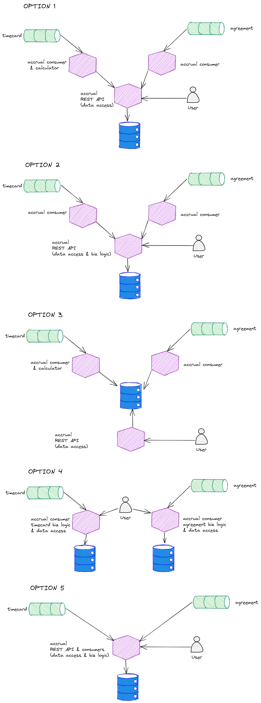

# Callisto component data access

## Summary

### Issue
Our containers need to persist state. We want to avoid a big shared data store common to all of our containers to remove a single point of failure and to simplify maintainance and development.

- How should our Callisto components interact with data stores eg direct access via the underlying data store communication protocol (eg ODBC) or via a RESTful API
- How far does Callisto separate our data stores within a container eg one shared data store amongst the components of a container or each component has its own data store

### Decision
TBC

### Status
UNDECIDED

## Details

### Assumptions
- Compoeents from one container cannot directly access the data store(s)belonging to the componenets of another container

### Constraints

- speed of initial development
- independently scalable
- supports concurrent development
- deployment simplicity
- impact of breaking schema change
- speed of issue identification
- speed of throughput
- attack vector surface

### Options

### Selected Option

### Implications

## Related

### Related decisions

### Related requirements
